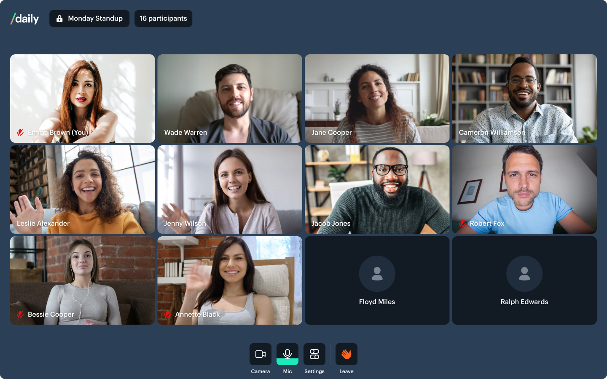

# Fitness Demo



### Live example

**[See it in action here ➡️](https://custom-fitness-demo.vercel.app)**

---

## What does this demo do?

- Built on [NextJS](https://nextjs.org/)
- Create a Daily instance using call object mode
- Manage user media devices
- Render UI based on the call state
- Handle media and call errors
- Obtain call access token via Daily REST API
- Handle preauthentication, knock for access and auto join

Please note: this demo is not currently mobile optimised

### Getting started

```
# set both DAILY_API_KEY and DAILY_DOMAIN
mv env.example .env.local

# from project root...
yarn
yarn workspace @custom/fitness-demo dev
```

## How does this example work?

This demo puts to work the following [shared libraries](../shared):

**[MediaDeviceProvider.js](../shared/contexts/MediaDeviceProvider.js)**
Convenience context that provides an interface to media devices throughout app

**[CallProvider.js](../shared/contexts/CallProvider.js)**
Primary call context that manages Daily call state, participant state and call object interaction

**[useCallMachine.js](../shared/contexts/useCallMachine.js)**
Abstraction hook that manages Daily call state and error handling

**[ParticipantsProvider.js](../shared/contexts/ParticipantsProvider.js)**
Manages participant state and abstracts common selectors / derived data

## Deploy your own on Vercel

[](https://vercel.com/new/daily-co/clone-flow?repository-url=https%3A%2F%2Fgithub.com%2Fdaily-demos%2Fexamples.git&env=DAILY_DOMAIN%2CDAILY_API_KEY&envDescription=Your%20Daily%20domain%20and%20API%20key%20can%20be%20found%20on%20your%20account%20dashboard&envLink=https%3A%2F%2Fdashboard.daily.co&project-name=daily-examples&repo-name=daily-examples)
