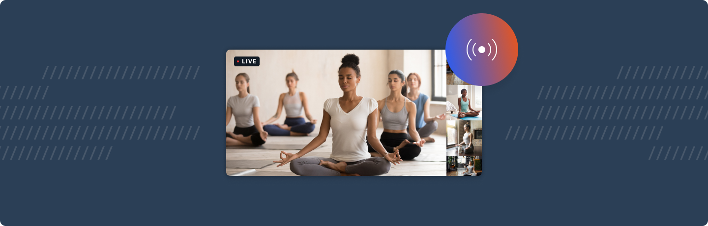

# Live Streaming



### Live example

**[See it in action here ➡️](https://custom-live-streaming.vercel.app)**

---

## What does this demo do?

- Use [startLiveStreaming](https://docs.daily.co/reference#%EF%B8%8F-startlivestreaming) to send video and audio to specified RTMP endpoint
- Listen for stream started / stopped / error events
- Allows call owner to specify stream layout (grid, single participant or active speaker) and maximum cams
- Extends the basic call demo with a live streaming provider, tray button and modal
- Show a notification bubble at the top of the screen when live streaming is in progress

Please note: this demo is not currently mobile optimised

## Pre-requisites

To use this demo, you will need to create a [Daily account](https://dashboard.daily.co/signup) and a [Daily room](https://dashboard.daily.co/rooms/create).

You will also need to enter an RTMP URL in the demo UI to start a live stream. To learn more about where to find this value, please read Daily's [live streaming guide](https://docs.daily.co/guides/paid-features/live-streaming-with-daily). You may also find the [live streaming with AWS's IVS tutorial](https://www.daily.co/blog/live-stream-daily-calls-with-only-3-second-latency/) helpful.

## Getting started

```
# set both DAILY_API_KEY and DAILY_DOMAIN
mv env.example .env.local

yarn
yarn workspace @custom/live-streaming dev
```

## How does this example work?

In this example we extend the [basic call demo](../basic-call) with live streaming functionality.

We pass a custom tray object, a custom app object (wrapping the original in a new `LiveStreamingProvider`) and a custom modal. We also symlink both the `public` and `pages/api` folders from the basic call.

Single live streaming is only available to call owners, you must create a token when joining the call (for simplicity, we have disabled the abiltiy to join the call as a guest.)

## Deploy your own on Vercel

[](https://vercel.com/new/daily-co/clone-flow?repository-url=https%3A%2F%2Fgithub.com%2Fdaily-demos%2Fexamples.git&env=DAILY_DOMAIN%2CDAILY_API_KEY&envDescription=Your%20Daily%20domain%20and%20API%20key%20can%20be%20found%20on%20your%20account%20dashboard&envLink=https%3A%2F%2Fdashboard.daily.co&project-name=daily-examples&repo-name=daily-examples)
