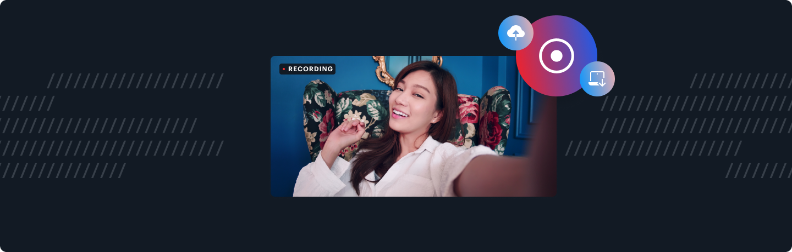

# Recording



---

## What does this demo do?

- Use [startRecording](https://docs.daily.co/reference#%EF%B8%8F-startrecording) to create a video and audio recording of your call. You can read more about Daily call recording (and the different modes and types) [here](https://docs.daily.co/guides/recording-calls-with-the-daily-api)
- Supports `cloud`, `cloud-beta`, `local`, and `rtp-tracks` recording modes (specified when creating the room or managed using the Daily dashboard). _Heads up: if recording on mobile devices or Safari, then `cloud-beta` must be the specified mode._ 
- Coming soon: support different recording layouts / composites
- Coming soon: use the Daily REST API to retrieve a list of cloud recordings for the currently active room

**To turn on recording, you need to be on the Scale plan. There is also a per minute recording fee for cloud recording.**

Please note: this demo is not currently mobile optimised. 

### Getting started

```
# set both DAILY_API_KEY and DAILY_DOMAIN
mv env.example .env.local

yarn
yarn workspace @custom/recording dev
```

### How does this demo work?

This example introduces a new [RecordingProvider](./contexts/RecordingProvider.js) context that listens for the various [recording events](https://docs.daily.co/reference#recording-started), counts down to begin a recording and stops a currently active recording. We also introduce a new recording modal and tray button.

Remember to follow the best practises detailed in [the documentation](https://docs.daily.co/reference#recordings) to avoid lengthy or stuck recordings.

## Deploy your own on Vercel

[](https://vercel.com/new/daily-co/clone-flow?repository-url=https%3A%2F%2Fgithub.com%2Fdaily-demos%2Fexamples.git&env=DAILY_DOMAIN%2CDAILY_API_KEY&envDescription=Your%20Daily%20domain%20and%20API%20key%20can%20be%20found%20on%20your%20account%20dashboard&envLink=https%3A%2F%2Fdashboard.daily.co&project-name=daily-examples&repo-name=daily-examples)
