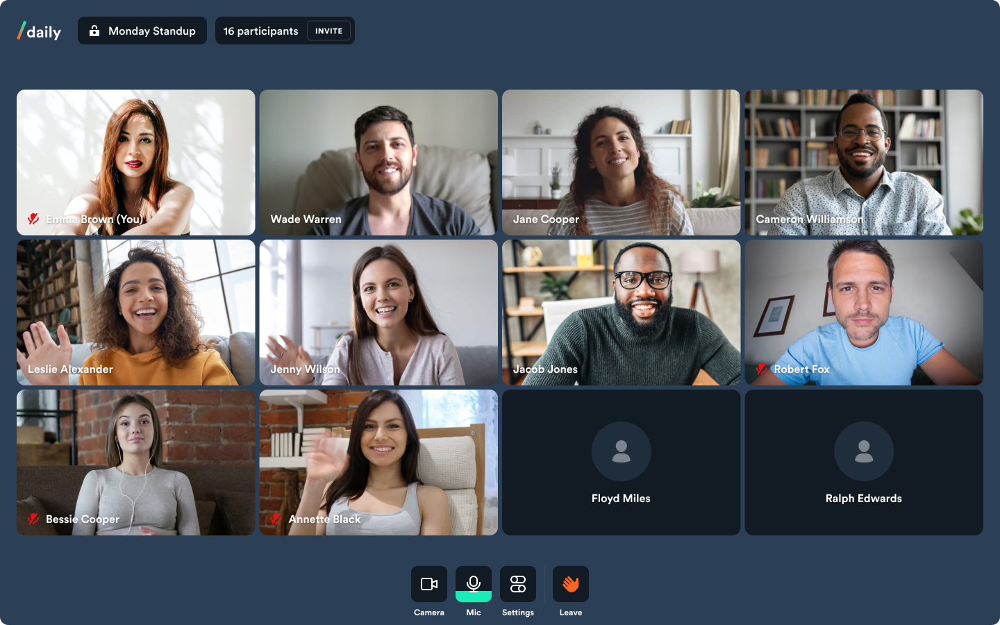

# Basic call



## What does this demo do?

- Built on [NextJS](https://nextjs.org/)
- Create a Daily instance using call object mode
- Manage user media devices
- Render UI based on the call state
- Handle media and call errors
- Obtain call access token via Daily REST API
- Handle preauthentication, knock for access and auto join

Please note: this demo is not currently mobile optimised

### Getting started

```
# set both DAILY_API_KEY and DAILY_DOMAIN
mv env.example .env.local

# from project root...
yarn
yarn workspace @dailyjs/basic-call dev
```

## How does this example work?

This demo puts to work the following [shared libraries](../shared):

**[MediaProvider.js](../shared/contexts/MediaProvider.js)**
Convenience context that provides an interface to media devices throughout app

**[useDevices.js](../shared/hooks/useDevices.js)**
Hook for managing the enumeration and status of client media devices)

**[CallProvider.js](../shared/contexts/CallProvider.js)**
Primary call context that manages Daily call state, participant state and call object interaction

**[useCallMachine.js](../shared/hooks/useCallMachine.js)**
Abstraction hook that manages Daily call state and error handling

**[ParticipantProvider.js](../shared/contexts/ParticipantProvider.js)**
Manages participant state and abstracts common selectors / derived data
