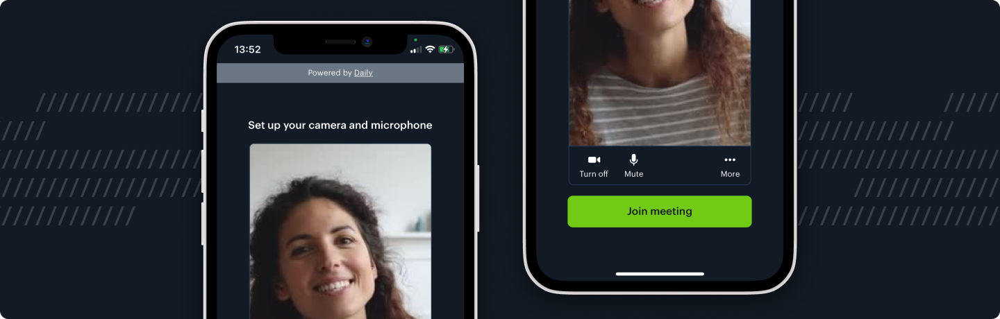

# WKWebView prebuilt example

## What does this demo do?

Embeds the Daily Prebuilt UI in native iOS applicaiton using WKWebView

Notes:

- `getUserMedia` support was added to WKWebView in iOS >=14.4
- You must add both `NSCameraUsageDescription` & `NSMicrophoneUsageDescription` to `info.plist` or `navigator.mediaDevices` will resolve as undefined

### Getting started

- Load XCode project
- Update the url property found in [ViewController.swift](./WebViewPrebuilt/ViewController.swift)
- Run on device / simulator targeting iOS >=14.4
