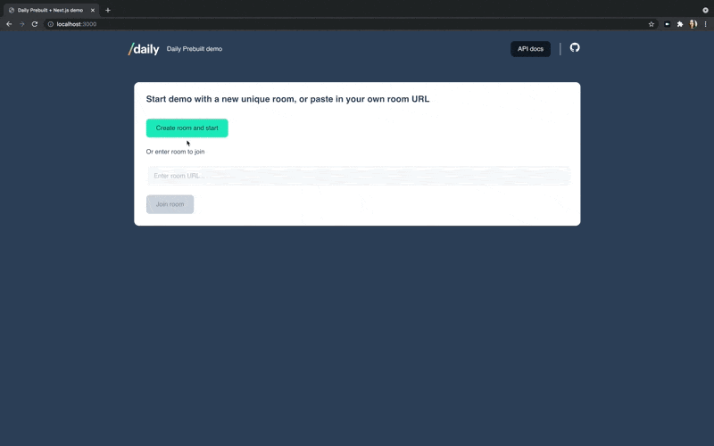

# Daily Prebuilt: Next.js demo 

**Test out the live demo**: [https://prebuilt-basic-embed.vercel.app/](https://prebuilt-basic-embed.vercel.app/)

## How the demo works 

This demo embeds [Daily Prebuilt](https://www.daily.co/prebuilt), a ready-to-use video chat interface, into a Next.js site. It makes use of [Next API routes](https://nextjs.org/docs/api-routes/introduction) to create Daily rooms server-side.  

## Requirements

You'll need to create a [Daily account](https://dashboard.daily.co/signup) before using this demo. You'll need your Daily API key, which you can find in your Daily dashboard on the [Developers page](https://dashboard.daily.co/developers), if you want to create rooms through the demo UI. 

You can also paste an existing Daily room into the input. The room URL should be in this format to be valid: https://domain-name.daily.co/room-name, with daily-domain changed to your domain, and room-name changed to the name of the existing room you would like to use.

# Running locally
1. Copy .env.example and change it to an .env.local with your own DAILY_API_KEY and DAILY_DOMAIN 
2. `cd basic-embed`
3. yarn 
4. yarn workspace @prebuilt/basic-embed dev

Or...

# Deploy your own on Vercel 

