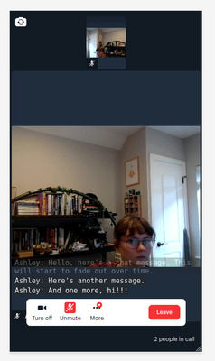

# Chat overlay

## What does this demo do?

- Adds full-screen [Daily Prebuilt](https://www.daily.co/prebuilt) to a page
- Using [`app-message`](https://docs.daily.co/reference#app-message) and [`sendAppMessage()`](https://docs.daily.co/reference#%EF%B8%8F-sendappmessage), send and receive chat messages (with or without `enable_chat` set to `true` in the room) 
- Allow users to send and receive chat messages while viewing other participants' videos

## Getting started

- Clone this repository and navigate to this folder (`git clone git@github.com:daily-demos/examples.git && cd prebuilt/chat-overlay`)
- Set `ROOM_URL` on the first line of `main.js` to a Daily room you have created. Sign up and create a room from the [Daily dashboard](https://dashboard.daily.co/signup), if you haven't already!
- Run a server from this repo's directory. You can use something like `python -m SimpleHTTPServer` run on the command line in the repo's directory or use VSCode's Live Server extension. See [How do you set up a local testing server?](https://developer.mozilla.org/en-US/docs/Learn/Common_questions/set_up_a_local_testing_server) for more info.
- Register for a Daily.co account and create a Room [in the dashboard](https://dashboard.daily.co/rooms), and use that room URL on this page. You can join that room directly using other browser tabs or another device.
- Visit the server in your browser! You can use multiple tabs for testing out the chat experience.
